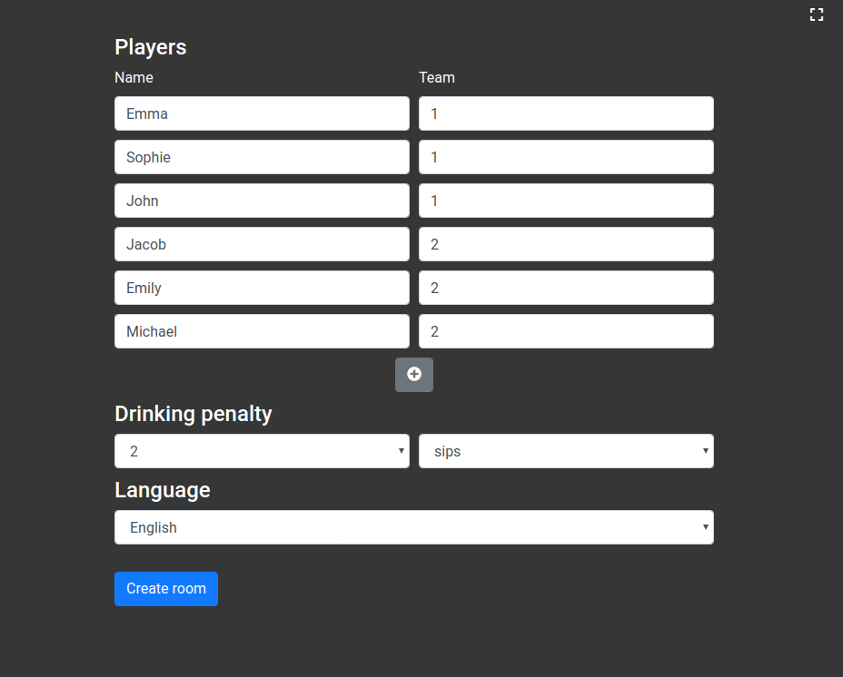

# DrunkDoodle
### Draw and guess based drinking game

With multiple teams and customizable penalty drinking amount. 
Played in real time on multiple devices (one 'artist' device, multiple 'audience' devices).

`C#, ASP.NET Core, SignalR, Javascript`

## Game Flow
- Room preparation
    * Client
        - Add players/teams
        - Specify drinking penalty
        - Choose language
    * Server
        - Create room
    
- Room setup
    * Client
        - Share audience link

    * Server
        - Connect audience devices

- Initialize round (1)
    * Client
        - Show 'Now drawing'

    * Server
        - Enqueue next drawer

    -- Go to (2)

- Start round (2)
    * Client
        - Begin (fake) countdown
        - Show word

    * Server
        - Get word
        - Handle (real) countdown

    -- Go to (3) or (4)

- Time's up (3)
    * Client
        - Disable drawing
        - Announce drinking penalty (drawer + team)

    * Server
        - Prepare drinking penalty

    -- Go to (1) --

- Word guessed (4)
    * Client
        - Disable drawing
        - Announce drinking penalty (everyone except drawer + team)
    
    * Server
        - Add score
        - Prepare drinking penalty

    -- Go to (1) --
